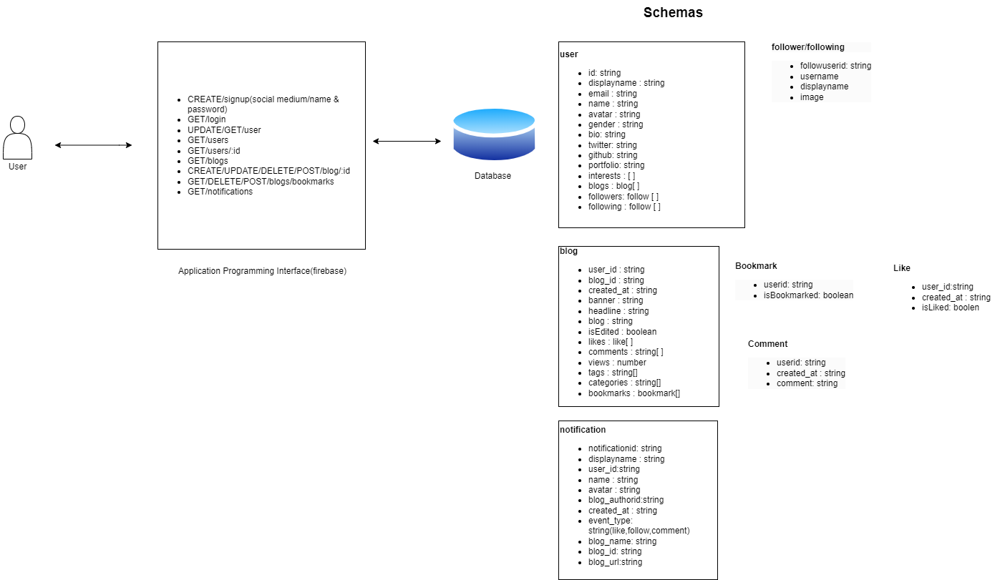

This is a [Next.js](https://nextjs.org/) project bootstrapped with [`create-next-app`](https://github.com/vercel/next.js/tree/canary/packages/create-next-app).

## Getting Started

First, run the development server:

```bash
npm run dev
# or
yarn dev
# or
pnpm dev
```

Open [http://localhost:3000](http://localhost:3000) with your browser to see the result.

You can start editing the page by modifying `app/page.tsx`. The page auto-updates as you edit the file.

This project uses [`next/font`](https://nextjs.org/docs/basic-features/font-optimization) to automatically optimize and load Inter, a custom Google Font.

## Learn More

To learn more about Next.js, take a look at the following resources:

- [Next.js Documentation](https://nextjs.org/docs) - learn about Next.js features and API.
- [Learn Next.js](https://nextjs.org/learn) - an interactive Next.js tutorial.

You can check out [the Next.js GitHub repository](https://github.com/vercel/next.js/) - your feedback and contributions are welcome!

## Deploy on Vercel

The easiest way to deploy your Next.js app is to use the [Vercel Platform](https://vercel.com/new?utm_medium=default-template&filter=next.js&utm_source=create-next-app&utm_campaign=create-next-app-readme) from the creators of Next.js.

Check out our [Next.js deployment documentation](https://nextjs.org/docs/deployment) for more details.

### Project name

Chatter

### Project description

A multi-functional platform where authors and readers can create and have access to their own content. Chatter aims to knock off competition from the likes of Hashnode and Medium in its first 2 years of launch.

## Project system Architecture

Screenshot of the project architecture:



### Project features

- User can create an account.
- User can login.
- User can create a post.
- User can view all posts.
- User can view a single post.
- User can update a post.
- User can delete a post.
- User can like a post.
- User can view all likes on a post.
- User can see all views analytics on a post.
- User can comment on a post.
- User can view all comments on a post.
- User can view all posts by a user.
- User can view all posts by a user.

### Project technologies

- Next.js
- TypeScript
- Module CSS
- React Query
- React Hook Form
- React Markdown
- React Syntax Highlighter
- React Share
- React Infinite Scroll
- React Timeago

### Project status

### Project structure explanation

- `app` - The main folder of the project, contains all the code of the project.
  - `components` - Contains all the components of the project.
  - `constants` - Contains all the constants of the project.
  - `hooks` - Contains all the hooks of the project.
  - `pages` - Contains all the pages of the project.
  - `styles` - Contains all the styles of the project.
  - `types` - Contains all the types of the project.
  - `utils` - Contains all the utils of the project.
- `public` - Contains all the public files of the project.
