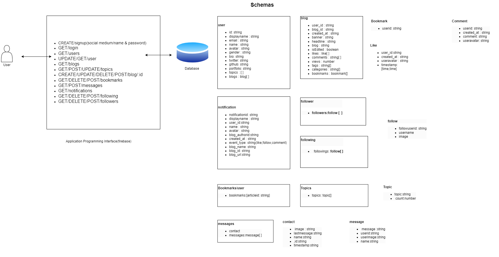

This is a [Next.js](https://nextjs.org/) project bootstrapped with [`create-next-app`](https://github.com/vercel/next.js/tree/canary/packages/create-next-app).

## Getting Started

First, run the development server:

```bash
npm run dev
# or
yarn dev
# or
pnpm dev
```

Open [http://localhost:3000](http://localhost:3000) with your browser to see the result.

You can start editing the page by modifying `app/page.tsx`. The page auto-updates as you edit the file.


### Project name

InkSpire

### Project description

A multi-functional platform where authors and readers can create and have access to their own content. InkSpire aims to knock off competition from the likes of Hashnode and Medium in its first 2 years of launch.

## Project system Architecture

Screenshot of the project architecture:



### Project features

- User can create an account.
- User can login.
- User can create a post.
- User can view all posts.
- User can view a single post.
- User can update a post.
- User can delete a post.
- User can like a post.
- User can bookmark a post.
- User can view all likes on a post.
- User can see all views analytics on a post.
- User can comment on a post.
- User can view all comments on a post.
- User can view all posts by a user.


### Project technologies

- Next.js
- TypeScript
- Module CSS
- Tailwind CSS
- React Markdown
- Cypress 
- React Share
- ESLint
- Prettier
- Husky
- Commit Lint
- emoji-picker-react
- Firebase
- date-fns


### Project status
95% complete

### Project structure explanation

- `app` - The main folder of the project, contains all the code of the project.
  - `components` - Contains all the components of the project.
  - `constants` - Contains all the constants of the project.
  - `hooks` - Contains all the hooks of the project.
  - `pages` - Contains all the pages of the project.
  - `styles` - Contains all the styles of the project.
  - `types` - Contains all the types of the project.
  -  `middlewares` - Contains all the middlewares of the project.
- `public` - Contains all the public files of the project.

### Project setup

- Clone the repository

```bash
git clone
```

- Install dependencies

```bash
npm install
```

- Run the project

```bash
npm run dev
```

- Run the tests

```bash
npm run test
```

### Project deployment

- Deploy the project to Vercel

```bash
npm run deploy
```

### Project screenshots


### Project demo

[InkSpire](https://ibimina-chatter.vercel.app)

